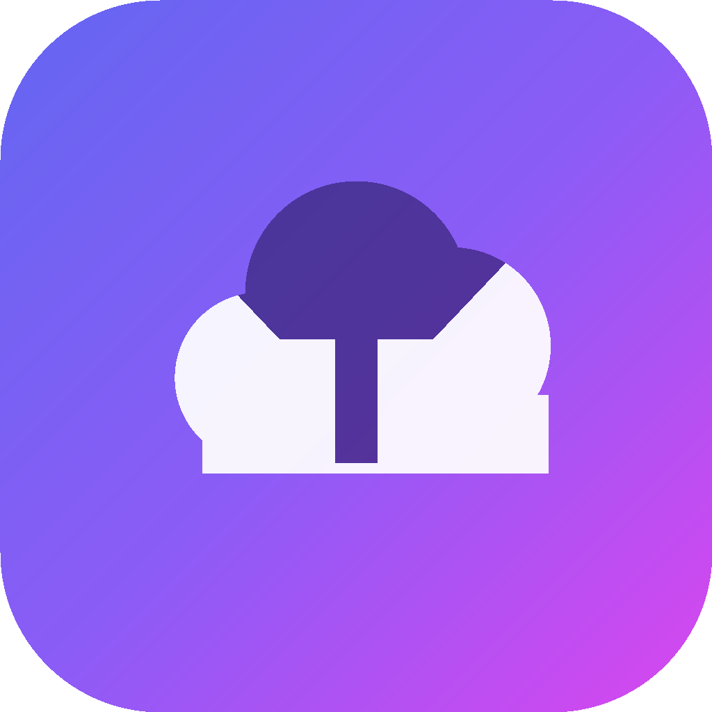

<div align="center">



# Drivecord

**Ton cloud illimité, propulsé par Discord.**

Un clone moderne et amélioré de [Disbox](https://github.com/DisboxApp/disbox) : stockage illimité via webhooks Discord, chiffrement de bout en bout, partage par lien et app native iOS — sans serveur de fichiers, sans abonnement.

[](https://nextjs.org)
[](https://react.dev)
[](https://www.typescriptlang.org)
[](https://www.prisma.io)
[](https://www.postgresql.org)
[](https://tailwindcss.com)
[](LICENSE)

[**🌐 Démo en ligne**](https://drivecord.vercel.app) · [**📲 Installer l'app iPhone**](https://drivecord.vercel.app/install)

</div>

---

## ✨ Fonctionnalités

- ♾️ **Stockage illimité** — les fichiers sont découpés en *chunks* et uploadés **en parallèle** sur un webhook Discord, ce qui dépasse la limite de taille par message.
- 🔒 **Chiffrement E2EE** — coffre-fort chiffré en **AES-256-GCM côté client** : tes fichiers sont chiffrés *avant* de quitter ton appareil.
- 🔗 **Partage avancé** — liens publics avec **mot de passe**, **date d'expiration** et **compteur de téléchargements**.
- 👀 **Preview streaming** — vidéos, PDF, audio et images directement dans l'app, même les `.mov` et `.HEIC` (conversion à la volée).
- 📁 **Organisation** — dossiers, tags colorés, favoris, recherche instantanée et glisser-déposer.
- ⬇️ **Téléchargement ZIP** — récupère un dossier entier en une archive.
- 🌓 **UI moderne** — mode sombre, animations soignées, design responsive.
- 📱 **App native iOS** — vraie app installable (Capacitor) avec Face ID et sauvegarde dans la pellicule.
- 🔐 **Authentification** — email / mot de passe, **Google** et **Discord** (Auth.js v5 + Prisma/PostgreSQL).
- 🛡️ **Espace admin** — gestion des utilisateurs.

## 🧠 Comment ça marche

```
Fichier ──▶ chiffrement (AES-256-GCM) ──▶ découpage en chunks ──▶ POST webhook Discord
   ▲                                                                      │
   │                                                                      ▼
déchiffrement ◀── réassemblage ◀── proxy (anti-expiration des liens) ◀── Discord héberge les octets
```

1. **Crée un webhook Discord** dans un salon *(Paramètres du salon → Intégrations → Webhooks)*. Gratuit, aucun bot requis.
2. **Connecte-le à Drivecord** — l'URL du webhook est **hashée localement** pour identifier ton drive ; les métadonnées (arborescence, références de chunks) vivent dans IndexedDB (Dexie) et la base.
3. **Upload & partage** — Discord héberge les octets chiffrés ; un proxy interne rafraîchit les liens d'attachements expirés au moment du téléchargement.

> Tes fichiers ne sont jamais lisibles par Discord : il ne stocke que des blobs chiffrés.

## 🏗️ Stack technique

| Domaine | Technologies |
|---|---|
| Framework | [Next.js 16](https://nextjs.org) (App Router) · [React 19](https://react.dev) · TypeScript |
| UI | Tailwind CSS 4 · [shadcn/ui](https://ui.shadcn.com) (Radix) · [Motion](https://motion.dev) · lucide-react · OGL |
| Auth | [Auth.js v5](https://authjs.dev) (Google, Discord, Credentials) · bcrypt |
| Base de données | PostgreSQL · [Prisma 7](https://www.prisma.io) |
| Stockage local | [Dexie](https://dexie.org) (IndexedDB) · Zustand · SWR |
| Stockage fichiers | Webhooks Discord (chunking + retry + proxy maison) |
| Mobile | [Capacitor 8](https://capacitorjs.com) (iOS) · biometric auth · media |
| Divers | jszip · heic2any · react-markdown · highlight.js · nanoid |

## 📁 Structure du projet

```
src/
├── app/                  # Routes App Router (pages + API)
│   ├── api/              # drive, webhooks, auth, partages (s/), proxy, admin…
│   ├── drive/            # interface principale du drive
│   ├── login/ register/  # authentification
│   ├── s/[token]/        # pages de partage public
│   └── settings/ stats/  # réglages & statistiques
├── components/           # UI (drive/, home/, ui/ shadcn)
├── lib/
│   ├── discord/          # cœur : webhook, chunking, retry, proxy
│   ├── crypto/           # coffre-fort E2EE (AES-256-GCM)
│   ├── storage/          # Dexie — drives, files, folders, tags
│   └── auth/             # helpers Auth.js, chiffrement, flux natif
├── auth.ts               # configuration Auth.js v5
└── generated/prisma/     # client Prisma généré
prisma/                   # schema.prisma + migrations
ios/ · capacitor-web/     # app native iOS (Capacitor)
```

## 🚀 Démarrage local

### Prérequis

- **Node.js 20+**
- Une base **PostgreSQL** (locale ou hébergée — ex. Neon, Supabase, Vercel Postgres)

### Installation

```bash
# 1. Cloner
git clone https://github.com/LeVraiLunatix/drivecord.git
cd drivecord

# 2. Installer les dépendances (génère aussi le client Prisma)
npm install

# 3. Configurer l'environnement
cp .env.example .env.local   # puis renseigne les valeurs (voir ci-dessous)

# 4. Appliquer le schéma à la base
npx prisma migrate dev

# 5. Lancer le serveur de dev
npm run dev
```

Ouvre **http://localhost:3000** 🎉

### Scripts

| Commande | Description |
|---|---|
| `npm run dev` | Serveur de développement |
| `npm run build` | `prisma generate` + build de production |
| `npm run start` | Serveur de production |
| `npm run lint` | ESLint |

## 🔑 Variables d'environnement

À placer dans `.env.local` :

| Variable | Requis | Description |
|---|---|---|
| `DATABASE_URL` | ✅ | Chaîne de connexion PostgreSQL |
| `AUTH_SECRET` | ✅ | Secret Auth.js (`npx auth secret`) |
| `ENCRYPTION_KEY` | ✅ | Clé de chiffrement serveur (données sensibles) |
| `AUTH_GOOGLE_ID` / `AUTH_GOOGLE_SECRET` | ⬜ | OAuth Google |
| `AUTH_DISCORD_ID` / `AUTH_DISCORD_SECRET` | ⬜ | OAuth Discord |
| `ADMIN_EMAIL` | ⬜ | E-mail donnant accès à l'espace admin |
| `AUTH_URL` | ⬜ | URL de base (utile en local / hors Vercel) |

## 📱 App iOS (Capacitor)

L'app native charge `https://drivecord.vercel.app` dans une WebView et y ajoute Face ID, l'accès à la pellicule et la sauvegarde de fichiers.

```bash
npx cap sync ios
npx cap open ios   # nécessite macOS + Xcode
```

`appId` : `com.lunatix.drivecord` — voir [`capacitor.config.json`](capacitor.config.json).

## ☁️ Déploiement

Pensé pour **[Vercel](https://vercel.com)** : connecte le repo, ajoute les variables d'environnement et déploie. La commande de build (`prisma generate && next build`) est déjà configurée.

## ⚠️ Avertissement

Projet **personnel et éducatif**, non affilié à Discord. Le stockage de fichiers arbitraires via les webhooks peut entrer en tension avec les Conditions d'utilisation de Discord — utilise-le de façon responsable et à tes propres risques. Inspiré du projet [Disbox](https://github.com/DisboxApp/disbox).

## 📄 Licence

Distribué sous licence **MIT**. Voir [`LICENSE`](LICENSE).

---

<div align="center">

Fait avec 💜 par [Lunatix](https://github.com/LeVraiLunatix)

</div>
