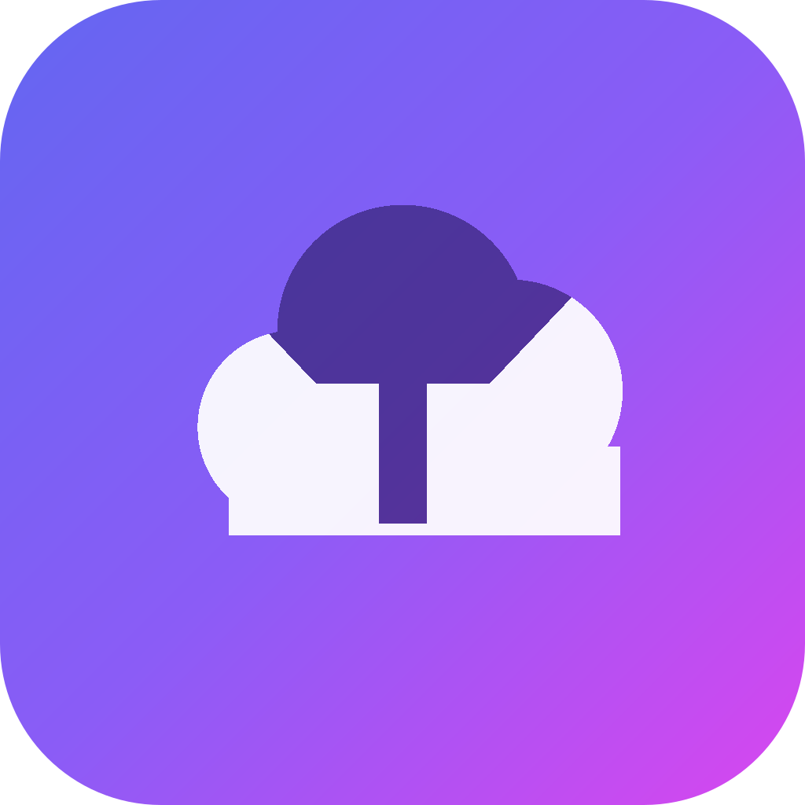

<div align="center">

<a href="https://drivecord.app">
  
</a>

<br><br>

[](https://drivecord.app)


[](LICENSE)

<br>

**Ton cloud illimité, chiffré de bout en bout, sans facture.**<br>
Tes fichiers sont chiffrés sur ton appareil, découpés, puis stockés via un webhook Discord que tu possèdes.

<br>

[**🌐 Ouvrir Drivecord**](https://drivecord.app) &nbsp;·&nbsp; [**📲 App iPhone**](https://drivecord.app/install) &nbsp;·&nbsp; [**🪟 Sur Windows**](https://github.com/LeVraiLunatix/cordlauncher-releases/releases/latest/download/CordLauncher-Setup.exe) &nbsp;·&nbsp; [**📖 Documentation**](https://drivecord.app/docs)

</div>

<br>

<p align="center"></p>

<br>

## Pourquoi Drivecord

Parce qu'un cloud ne devrait coûter ni un abonnement, ni ta vie privée. Drivecord est **gratuit pour tout le monde, sans limite de stockage, sans pub**, et les fichiers sont **chiffrés avant même de quitter ton appareil**. Il ne stocke pas tes fichiers sur un serveur à lui : il les confie, chiffrés et en morceaux, à un salon que **tu** contrôles.

<table>
  <tr>
    <td width="33%" valign="top">
      <h3>♾️ Illimité</h3>
      Les fichiers sont découpés en morceaux envoyés <b>en parallèle</b>, ce qui dépasse la limite de taille par message. Pas de quota, pas de palier payant.
    </td>
    <td width="33%" valign="top">
      <h3>🔒 Chiffré de bout en bout</h3>
      <b>AES-256-GCM côté client</b>, une <b>clé aléatoire par drive</b>, et un <b>coffre-fort</b> protégé par ton PIN. Discord ne voit que des octets illisibles.
    </td>
    <td width="33%" valign="top">
      <h3>🆓 Vraiment gratuit</h3>
      Toutes les fonctions sont pour tout le monde. Le <a href="https://drivecord.app/supporters">soutien</a> via Patreon n'apporte que des bonus cosmétiques, jamais de restriction.
    </td>
  </tr>
</table>

## Comment ça marche

<p align="center"></p>

1. **Crée un webhook** dans un salon Discord à toi *(Paramètres du salon › Intégrations › Webhooks)*. Gratuit, aucun bot à installer.
2. **Connecte-le à Drivecord.** L'adresse du webhook, hachée sur ton appareil, identifie ton drive ; l'arborescence et les références des morceaux sont gardées sur ton compte et en local (IndexedDB).
3. **Envoie, organise, partage.** Au téléchargement, un proxy rafraîchit les liens des pièces jointes qui ont expiré, puis ton appareil réassemble et déchiffre.

Le modèle de sécurité est détaillé, honnêtement, dans la [documentation Sécurité](https://drivecord.app/docs/securite/chiffrement).

## Tout ce que ça fait

<table>
  <tr>
    <td width="50%" valign="top">
      <h3>📁 Organiser</h3>
      Dossiers, tags colorés, favoris, recherche instantanée, glisser-déposer, corbeille, téléchargement d'un dossier entier en <b>ZIP</b>, statistiques de ton espace.
    </td>
    <td width="50%" valign="top">
      <h3>👀 Tout ouvrir</h3>
      Aperçu en streaming des vidéos, PDF, sons et images, même les <code>.mov</code> et <code>.HEIC</code> de l'iPhone, convertis à la volée.
    </td>
  </tr>
  <tr>
    <td width="50%" valign="top">
      <h3>🔗 Partager</h3>
      Liens publics avec <b>mot de passe</b>, <b>date d'expiration</b> et <b>nombre de téléchargements</b> limité. Le fichier est déchiffré pour le partage, jamais la clé du coffre.
    </td>
    <td width="50%" valign="top">
      <h3>📱 Sur ton iPhone</h3>
      Une vraie app, avec Face ID et la <b>sauvegarde de la pellicule</b>. Installée et renouvelée par <a href="https://github.com/LeVraiLunatix/cordlauncher">CordLauncher</a> ou AltStore.
    </td>
  </tr>
  <tr>
    <td width="50%" valign="top">
      <h3>🪟 Sur Windows</h3>
      <a href="https://github.com/LeVraiLunatix/drivecord-desktop">Drivecord Desktop</a>, l'app Windows, s'installe en un clic depuis CordLauncher.
    </td>
    <td width="50%" valign="top">
      <h3>🪪 Connexion comme tu veux</h3>
      <b>Compte Cord</b> (« Continuer avec Cord », ou Passcord et Face ID), <b>passkeys</b>, <b>double authentification</b>, Google, Discord, ou e-mail et mot de passe.
    </td>
  </tr>
  <tr>
    <td width="50%" valign="top">
      <h3>🧩 API publique</h3>
      Des clés API (<code>/api/v1</code>) pour envoyer, lister, télécharger et supprimer des fichiers d'un drive depuis ton propre site. Voir la <a href="https://drivecord.app/docs/technique/api">doc de l'API</a>.
    </td>
    <td width="50%" valign="top">
      <h3>🤝 Avec ton serveur Discord</h3>
      Stockage sur un serveur dédié, salons de statut, vérification des membres par bouton, rôles des soutiens synchronisés.
    </td>
  </tr>
</table>

## Sous le capot

| Domaine | Technologies |
|---|---|
| Web | [Next.js 16](https://nextjs.org) (App Router) · [React 19](https://react.dev) · TypeScript · Tailwind CSS 4 · [shadcn/ui](https://ui.shadcn.com) · [Motion](https://motion.dev) |
| Comptes | [Auth.js v5](https://authjs.dev) (Compte Cord en OIDC, Google, Discord, e-mail) · passkeys (WebAuthn) · TOTP |
| Données | PostgreSQL · [Prisma 7](https://www.prisma.io) · [Dexie](https://dexie.org) (IndexedDB) · Zustand · SWR |
| Chiffrement | Web Crypto : AES-256-GCM, clé par drive, coffre dérivé du PIN (PBKDF2, 200 000 itérations) |
| Stockage | Webhooks Discord : découpage, envois parallèles, reprises, proxy anti-expiration |
| iPhone | [Capacitor 8](https://capacitorjs.com) : Face ID, pellicule ; build signé dans le cloud (GitHub Actions) et publié comme source [AltStore](https://github.com/LeVraiLunatix/drivecord-releases) |

```
src/
├── app/                  pages et API (App Router)
│   ├── api/              drive, webhooks, auth, partages, proxy, v1 (API publique), admin…
│   ├── drive/            l'interface principale
│   ├── s/[token]/        pages de partage public
│   └── docs/             la documentation (prise en main, utilisation, sécurité, API)
├── components/           interface (drive/, home/, ui/)
├── lib/
│   ├── discord/          le cœur : webhook, découpage, reprises, proxy
│   ├── crypto/           chiffrement du drive et du coffre-fort
│   ├── storage/          Dexie : drives, fichiers, dossiers, tags
│   └── auth/             Auth.js, flux de connexion de l'app iPhone
└── auth.ts               configuration Auth.js v5
prisma/                   schéma de la base
ios/ · capacitor-web/     app iPhone (Capacitor)
```

## Lancer Drivecord chez toi

<details>
<summary><b>Démarrage local</b></summary>
<br>

Il te faut **Node.js 20+** et une base **PostgreSQL** (locale ou hébergée : Neon, Supabase…).

```bash
git clone https://github.com/LeVraiLunatix/drivecord.git
cd drivecord
npm install                   # génère aussi le client Prisma
cp .env.example .env.local    # puis remplis les valeurs (voir plus bas)
npx prisma db push            # crée les tables dans ta base
npm run dev                   # http://localhost:3000
```

| Commande | Rôle |
|---|---|
| `npm run dev` | serveur de développement |
| `npm run build` | `prisma generate` + build de production |
| `npm run start` | serveur de production |
| `npm run lint` · `npm test` | ESLint · tests |
</details>

<details>
<summary><b>Variables d'environnement</b></summary>
<br>

À mettre dans `.env.local` (le modèle complet est dans [`.env.example`](.env.example)) :

| Variable | | Rôle |
|---|:-:|---|
| `DATABASE_URL` · `DIRECT_URL` | ✅ | Base PostgreSQL |
| `AUTH_SECRET` | ✅ | Secret Auth.js (`npx auth secret`) |
| `ENCRYPTION_KEY` | ✅ | Chiffre côté serveur les données sensibles (adresses de webhook, clés de drive) |
| `AUTH_CORD_ISSUER` · `AUTH_CORD_ID` · `AUTH_CORD_SECRET` · `NEXT_PUBLIC_CORD_ACCOUNT_URL` | | Connexion avec le Compte Cord |
| `AUTH_GOOGLE_*` · `AUTH_DISCORD_*` | | Connexion Google, Discord |
| `RP_ID` · `RP_NAME` · `WEBAUTHN_ORIGIN` · `TOTP_ISSUER` | | Passkeys et double authentification |
| `AUTH_RESEND_KEY` · `EMAIL_FROM` | | E-mails (codes, liens) |
| `DISCORD_BOT_TOKEN` · `DISCORD_*_GUILD_ID` · `DISCORD_ROLE_*` · `DISCORD_BOT_PUBLIC_KEY` | | Fonctions du serveur Discord (stockage dédié, rôles, vérification) |
| `APNS_*` | | Notifications de l'app iPhone |
| `ADMIN_EMAIL` | | Accès à l'espace d'administration |
</details>

<details>
<summary><b>Déployer</b></summary>
<br>

Pensé pour **[Vercel](https://vercel.com)** : connecte le dépôt, ajoute les variables d'environnement, déploie. La commande de build (`prisma generate && next build`) est déjà configurée.

Côté base, les changements de schéma sont **additifs** : sur une base qui vit déjà, on applique la différence avec `prisma migrate diff` puis `prisma db execute`, jamais `migrate reset`.
</details>

<details>
<summary><b>L'app iPhone</b></summary>
<br>

L'app charge le site dans une WebView native et y ajoute Face ID, l'accès à la pellicule et l'enregistrement de fichiers : les changements du site arrivent donc sans nouvelle version. Seuls les changements natifs (plugins, `capacitor.config.json`, `ios/`) relancent le build GitHub Actions, qui signe l'IPA et met à jour la source AltStore.

```bash
npx cap sync ios
npx cap open ios   # sur un Mac, avec Xcode
```
</details>

## Avertissement

Drivecord est un projet **indépendant**, **non affilié à Discord** et non approuvé par Discord. Stocker des fichiers via des webhooks peut entrer en tension avec les conditions d'utilisation de Discord : utilise-le de façon responsable, et garde une copie de ce qui compte vraiment. Drivecord s'inspire du projet [Disbox](https://github.com/DisboxApp/disbox).

## Contribuer

Les contributions sont les bienvenues ! Lis [CONTRIBUTING.md](CONTRIBUTING.md) : on en parle d'abord sur le [Discord de la suite](https://discord.gg/EyX2YR6nAy), une PR = un sujet, et chaque commit est signé (`git commit -s`, [DCO](https://developercertificate.org/)).

## 📄 Licence

Copyright © 2026 **Lunatix**.

Le code est distribué sous licence **[GNU AGPL v3.0 ou ultérieure](LICENSE)** : tu peux le lire, l'utiliser, le modifier et le redistribuer, à condition de partager tes modifications sous la même licence, y compris si tu le fais tourner comme service en ligne. Les noms et logos de la suite Cord n'en font pas partie : voir [NOTICE.md](NOTICE.md).

---

<div align="center">

<a href="https://drivecord.app"></a>

<sub>Fait avec 💜 par [Lunatix](https://github.com/LeVraiLunatix) · une app de la suite [Cord](https://www.cordsuite.app)</sub>

</div>
